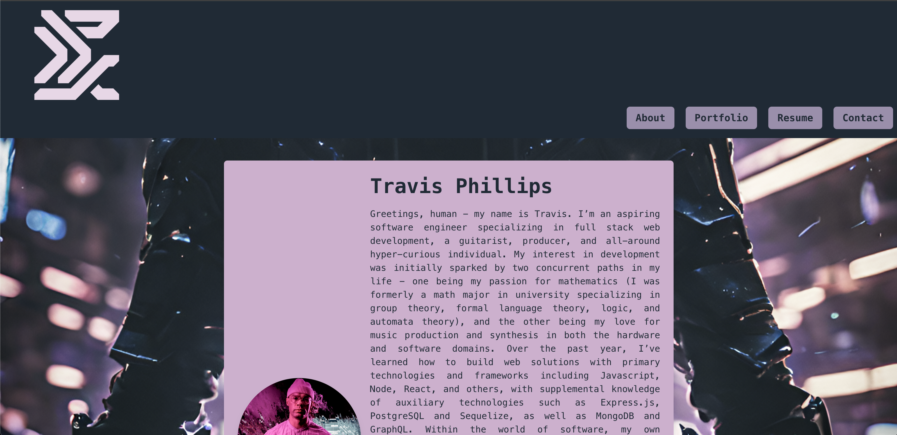

# Dev Portfolio - Travis Phillips

## Description
The following is a simple portfolio built in React that caps off and summarizes my journey through this web development bootcamp. The goal is to offer a brief yet comprehensive look at my experience both pre- and post-bootcamp and to showcase a number of projects that demonstrate the skills I have developed and will continue to build on, as well as offering potential employers and colleagues in the field a sample of my personal style for aesthetics and front-end UI. The projects featured were chosen to reflect the variety of skills acquired throughout the course, including front- and back-end development incorporating a host of industry-standard technologies and frameworks.

## Table of Contents
* [Installation](#installation)
* [Usage](#usage)
* [License](#license)
* [Contributing](#contributing)
* [Tests](#tests)
* [Credits](#credits)
* [Questions](#questions)

## Installation
`npm i` to install dependencies; `npm run dev` to run on your local machine.

## Usage
View the deployed application [here](https://hannahdevportfolio.netlify.app/).

This portfolio serves as a personal and professional showcase of my work. Feel free to navigate through the different sections to explore my projects, learn about my skills, and get in touch. Whether you are a potential collaborator, employer, or fellow developer, I hope you find my work inspiring and informative!

## License
This project is licensed under the MIT license. Please feel free to read the license in full detail [here](https://opensource.org/license/mit)

## Contributing
Please contact me regarding contributions to the repo.

## Tests
N/A

## Credits
Icons by icons8.com

## Questions
Please contact me with any additional questions.

Github: https://github.com/Travisgage

Email: travisgagephillips@gmail.com